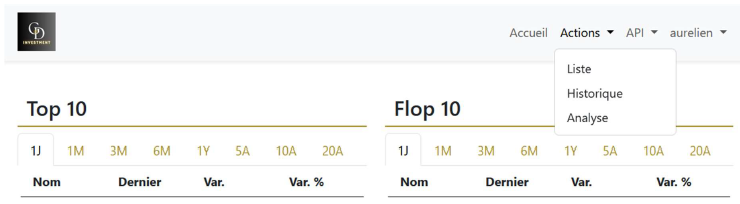
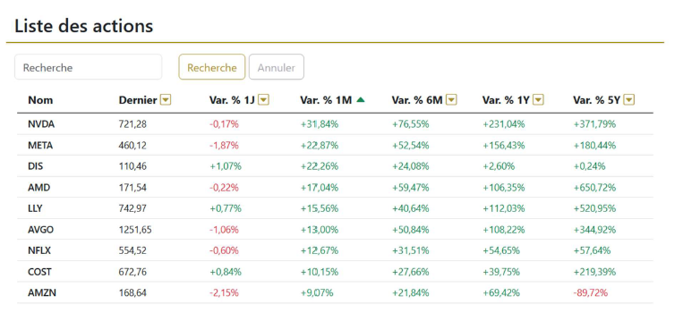
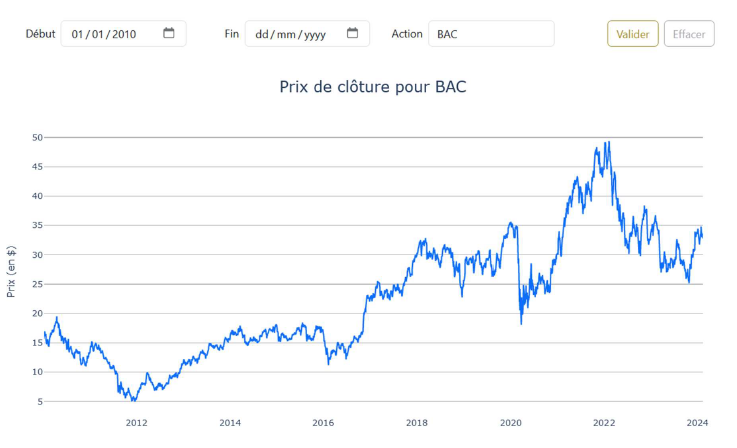
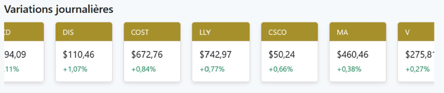
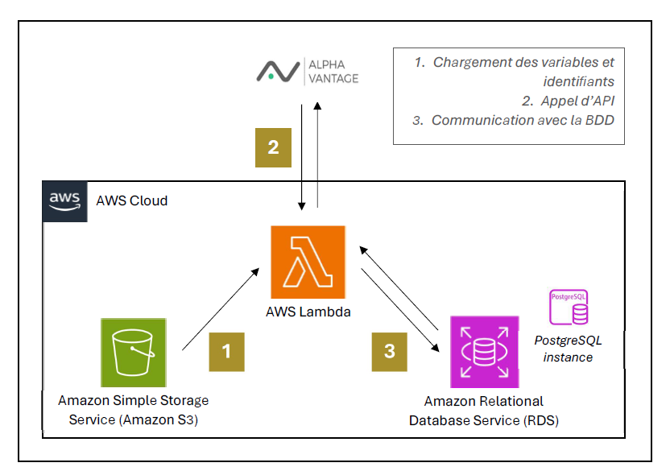
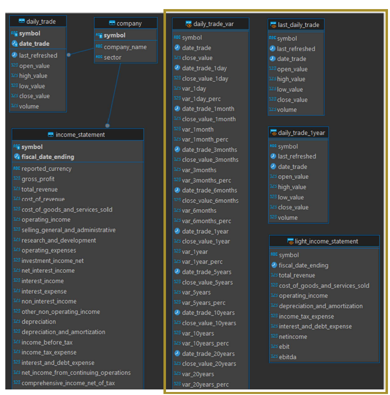
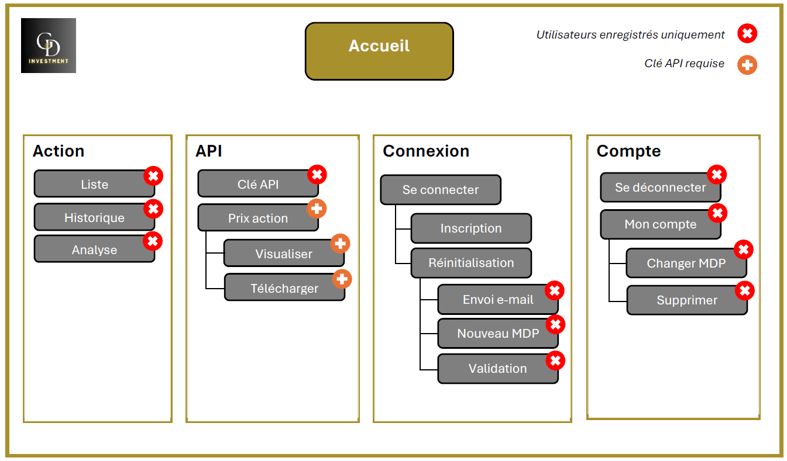
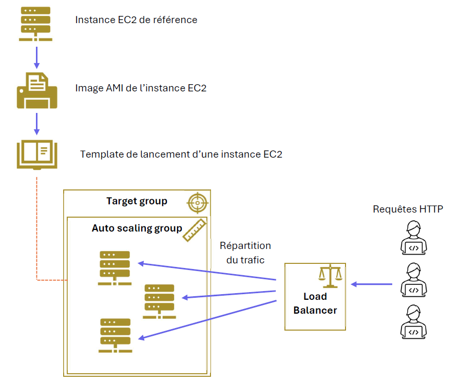

# G&D investment
Aim of this project is to collect stocks financial data, transform and store it in a database and expose it through a website using AWS cloud services.

## 1. Data collection (get-data-lambda folder)
Data is collected through an AWS Lambda function write down in python. The Lambda function connect to an API, collect data from a list of stocks in an file stored in a S3 bucket, transform it using pandas library and load it in a RDS instance (PostgreSQL).
The Lambda function deployment was done through Serverless framework.

## 2. Data storage and transormation (sql folder)
Data is loaded into a PostgreSQL database. In order to optimize website request to database, raw data in table are transformed and stored into materialized views.

## 3. Website (folder gd_investment)
Mainly build in python using Django framework. For CSS part, Bootstrap framework was used. Herebelow is website tree structure.

Website functionalities are:
- Stocks data vizualization
- Registration and connection
- Password recovery
- Data downloading through API

## 4. Hosting
The website was hosted for several months (now decommissioned) on AWS using EC2 instances with Nginx server, load balancer, target group and auto scaling group.

